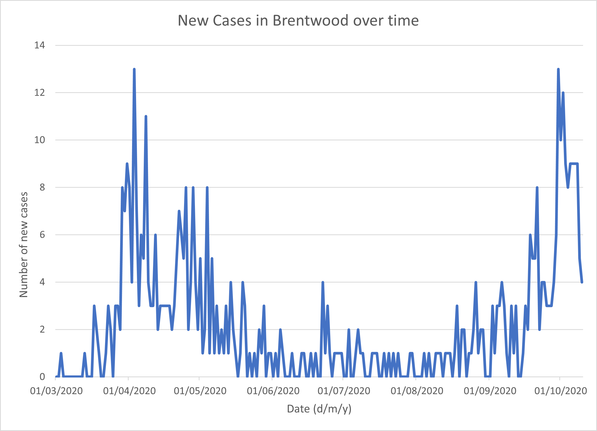
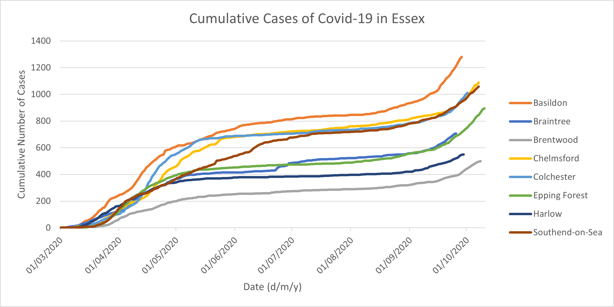
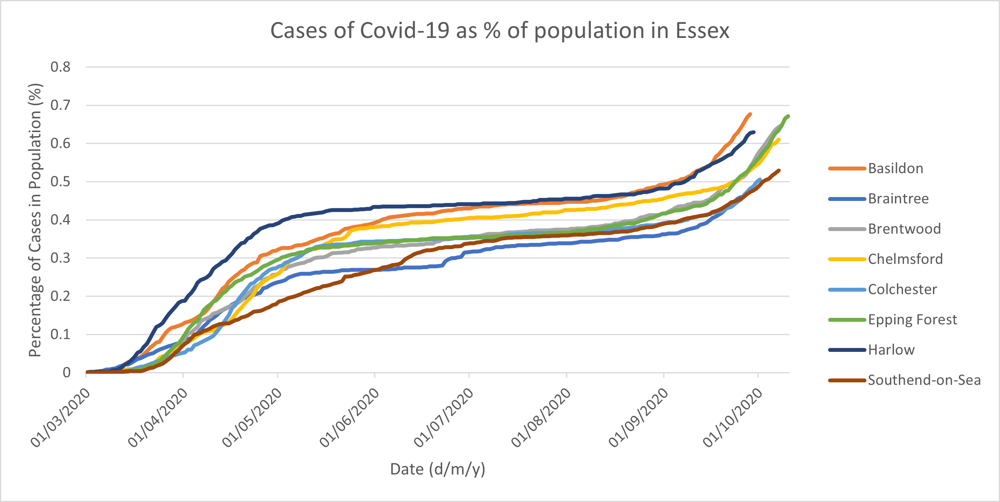

#*GY7702 Assignment 1*

##*This document was written in R MarkDown using rserver and knitted using the 'knit' function to create a pdf. I regularly saved and updated the file data to GitHub using the Commit and Push commands in Rserver.* 

##Here is the link to my GitHub repository: https://github.com/Jembery/GY7702_CW1

```{r setup, include=FALSE}
knitr::opts_chunk$set(echo = TRUE)
rm(list = ls())
```

###Load the two libraries tidyverse and knitr
```{r load_libraries_Q1, warning=FALSE, message=FALSE}
library(tidyverse)
library(knitr)
```

#Question 1:


##Create the vector of 25 numbers between 1 and 7 listed below, using the function c. Assume those values represent the answers to a survey question, following the scale presented further below.

### [1] NA 3 4 4 5 2 4 NA 6 3 5 4 0 5 7 5 NA 5 2 4 NA 3 3 5 NA

### 1 = completely disagree
### 2 = disagree
### 3 = somehow disagree
### 4 = neither agree nor disagree
### 5 = somehow agree
### 6 = agree
### 7 = completely agree
### NA = missing value


##**Question 1.1:** write the code necessary to check whether all participants to the survey either completely disagree or completely agree, once the missing values are excluded.


```{r}
#First make the vector containing all the answers to the question
survey_answer <-
  c(NA, 3, 4, 4, 5, 2, 4, NA, 6, 3, 5, 4, 0, 5, 7, 5, NA, 5, 2, 4, NA, 3, 3, 5, NA)

#Before doing anything you must remove NA values from the vector
survey_answer = survey_answer[
  !is.na(survey_answer)]

#1 = completely disagree so this asks the vector if all values are equal to 1.
print(paste(
  "Do all participants completely disagree?", all(survey_answer == 1)
  ))

#7 = completely agree, same as above.
print(paste(
  "Do all participants completely agree?", all(survey_answer == 7)
  ))
```


##**Question 1.2:** write the code necessary to extract the indexes related to the participants in the survey who at least somehow agree or more.


```{r}
#the which function used to extract 5, 6 and 7 (in the vector c) out of the
#survey_answer vetor
which(survey_answer %in% c(5,6,7))
```


#Question 2:


##**Question 2.1:** Install the library palmerpenguins.
  
  
```{r load_libraries_Q2, warning=FALSE, message=FALSE}

#install.packages("palmerpenguins")
#create a variable for the table of data to be called from
pengtable <- palmerpenguins::penguins 
#View(pengtable)

#install palmer penguins library 
library(palmerpenguins) 
#install dplyr library
library(dplyr) 
#install tidyverse library
library(tidyverse) 
```


##**Question 2.2:** write the code necessary to create a table showing species, island, bill length and body mass of the 10 Gentoo penguins in the penguins table with the highest body mass.
  
  
```{r}
#working from this table
pengtable %>%
  #select the variables required out of pengtable
  dplyr::select(species, island, bill_length_mm, body_mass_g) %>% 
  #remove na values
  na.omit(pengtable) %>% 
  #filter so only work with the species "Gentoo" 
  dplyr::filter(species == "Gentoo") %>% 
  #display the top 10 values for body mass
  dplyr::slice_max(body_mass_g, n = 10) %>%
  #improve table format
  kable()
```


##**Question 2.3:** write the code necessary to create a table showing the average bill length per island, ordered by average bill length.
  
  
```{r}
 #working from this table
 pengtable %>%
  #select the variables required out of pengtable
  dplyr::select(bill_length_mm, island) %>% 
  #remove na values
  na.omit(pengtable) %>% 
  #group the coloumns by island
  dplyr::group_by(island) %>% 
  #create a new column and calculate average bill length per island
  #.groups = 'keep' keeps the same grouping after the summarise and stops any
  #friendly errors in console.
  dplyr::summarise(
    avg_bill_length_mm = mean(bill_length_mm), .groups = 'keep'  
    ) %>% 
  #arrange in accending avg_bill_length_mm
  dplyr::arrange(avg_bill_length_mm) %>%
  #improve table format
  kable()
```


##**Question 2.4:** write the code necessary to create a table showing the minimum, median and maximum proportion between bill length and bill depth by species.
  
  
```{r}
#working from this table
pengtable %>%
  #select the variables required out of pengtable
    dplyr::select(bill_length_mm, bill_depth_mm, species) %>% 
  #remove na values
    na.omit(pengtable) %>% 
  #group columns by species
    dplyr::group_by(species) %>% 
  #create new column/variable for bill proportion
    dplyr::mutate(
      bill_proportion = bill_length_mm / bill_depth_mm 
      ) %>%
    dplyr::summarise(
      #create new column for minimum proportion
      min_proportion = min(bill_proportion),
      #create new column for median proportion
      med_proportion = median(bill_proportion), 
      #create new column for maximum proportion
      max_proportion = max(bill_proportion), 
      #.groups = 'keep' keeps the same grouping after the summarise and stops any
      #friendly errors in console
      .groups = 'keep' 
    ) %>% 
  #remove rows with repeated data, only 1 row per species
    dplyr::slice_head(n = 1) %>%
  #improve table format
    kable()
```


#Question 3:

###Download the file covid19_cases_20200301_20201017.csv from BlackBoard, which contains a table detailing the number of new and cumulative covid-19 cases in the UK between March 1st and October 17th, 2020, according to the official Government statistics.


##**Question 3.1:**Write the code necessary to load the data from covid19_cases 20200301_20201017.csv to a variable named covid_data.

###The code line below doesn't work in rserver.
###read_csv("Drive:Filelocation/Filename.csv")
###I uploaded the file using the upload button in the files tab.

```{r load_libraries, warning=FALSE, message=FALSE}
# load readr library
library(readr) 
#Using this code i can import the uploaded dataset and call it covid_data
covid_data <- read_csv("covid19_cases_20200301_20201017.csv") 
#view(data) has been commented out as errors occur when trying to knit for R Markdown
#View(covid_data) 

```


##**Question 3.2:** write the code necessary to:

### - Create a complete table, containing a row for each day and area.
### - Replace NA values with the value available for the previous date.
### - Replace the remaining NA values (those that don’t have a previous value available) with zero.
### - Subset only the area assigned to your student ID in the table in the appendix.
### - Drop the area_name column.
### - Store the resulting table in a variable named [area]_complete_covid_data (substituting [area] in the name of the variable with the name of the area assigned to you).


```{r}
#load the tidyr and dplyr libraries needed
library(tidyr)
library(dplyr)
#create a new table for only brentwood data
brentwood_complete_covid_data <- 
#use data from this table
covid_data %>% 
  #fill in the table with NA values where data is missing on certain days for an area
  tidyr::complete(specimen_date, area_name) %>% 
  #group by area
  dplyr::group_by(area_name) %>% 
  #arrange in the table in date order
  dplyr::arrange(specimen_date) %>% 
  #NA values fill downward (default) from the previous date if applicable
  tidyr::fill(newCasesBySpecimenDate, cumCasesBySpecimenDate) %>% 
  #replace any NA values in the column with 0
  tidyr::replace_na(list(newCasesBySpecimenDate = 0)) %>% 
  #replace any NA values in the column with 0
  tidyr::replace_na(list(cumCasesBySpecimenDate = 0)) %>% 
  #only display data for the area_name "Brentwood"
  dplyr::filter(area_name == "Brentwood") %>% 
  #select and created a new table for area_name = "Brentwood", so area name column no
  #longer needed and is dropped.
  subset(select = -c(area_name))
#display first five rows of the table
slice_head(brentwood_complete_covid_data, n = 5) %>%
#improve table format
kable()
```


##**Question 3.3:** Starting from the table [area]_complete_covid_data created for Question 3.2 :

### - Create a copy of [area]_complete_covid_data, i.e., as another variable named [area]_day_before.

### - Use the library lubridate to create a new column named day_before in the new table [area]_day_before that reports the day before the day reported in the column specimen_date, as a character value (e.g., if specimen_date is "2020-10-10", day_before should be "2020-10-09").

### - Drop the specimen_date and cumCasesBySpecimenDate columns from the [area]_day_before table.

### - Rename the newCasesBySpecimenDate column of the the [area]_day_before table to newCases_day_before.

### - Join [area]_day_before with [area]_complete_covid_data, where the column specimen_date of [area]_complete_covid_data is equal to the column day_before of [area]_day_before.

### - Calculate a new column in the joined table, containing the number of new cases as a percentage of the number of new cases of the day before.

### - Store the resulting table in a variable named [area]_covid_development.


```{r}
#create new table as a copy
brentwood_day_before <- 
#select data from this table
brentwood_complete_covid_data %>%
#create a new column day_to_match, don't need to use lubricate because already in date
#format (not a character)
dplyr::mutate(
  #make day_to_match the day after specimen_date
  day_to_match = (specimen_date + 1)
  ) %>%
#remove columns by summarise day to match, newCasesBySpecimenDate
dplyr::summarise(day_to_match, newCasesBySpecimenDate)
#change the name of column newCasesBySpecimenDate to newCases_day_before
colnames(brentwood_day_before) = c("day_to_match", "newCases_day_before")
#create the new table brentwood_covid_devolopment
brentwood_covid_development<-
#use data from this table
brentwood_complete_covid_data %>%
#join the new table brentwood_day_before into the originbal table 
#brentwood_complete_covid_date
dplyr::left_join(
  brentwood_day_before,
  #make specimen_date column equal to day_to_match column
  by = c("specimen_date" = "day_to_match")
) %>%
#create new column for percentage of the number of new cases of the day before
dplyr::mutate(
  percentage = ((newCasesBySpecimenDate /  newCases_day_before) * 100)
)
#remove infinite values from the percentage column in the brentwood_covid_development
#table and change them to NaN
brentwood_covid_development$percentage[is.infinite(
  brentwood_covid_development$percentage)]<- NaN

#shorten column names so they fit within the pdf margins when knitted
colnames(
  brentwood_covid_development) = c("specimen_date", "newCases",
                                   "cumCases", "newCases_day_before", "percentage")

#display first five rows of the table
slice_head(brentwood_day_before, n = 5) %>%
#improve table format
kable()
#display first five rows of the table
slice_head(brentwood_covid_development, n = 5) %>%
#improve table format
kable()
```


##**Question 3.4:** Write a short text (max 150 words) describing the development of new cases in the area over time, as evidenced by the table [area]_covid_development.




###Throughout the dataset an oscillation of case numbers over time can be observed (Figure 1). A frequent rise and fall of data occur within the general data trend. There is an initial small rise to 3 cases on the 17/03/2020, followed by a rapid peak to 13 cases on the 03/04/2020. New cases drop to 3 a day but rise again to 8 from the 25/04/2020 - 04/05/2020 forming a binormal distribution pattern. Cases begin to decline until there is 1 or 0 cases a day from approximately 29/05/2020 - 16/08/2020, with a few spikes and anomalies in late June and early July. From mid-August into September cases begin to rise, displaying an upward trend, and peak at 13 on the 30/09/2020 which is just as high as back in early April on the 3rd. When plotted on a graph the data would produce a 'cup' or U shape.


#Question 4:
###(Content warning: covid-19)
###Download the file lad19_population.csv from BlackBoard, which contains a table detailing the population per Local Authority District in the UK.
###Write the code necessary to load the population data into a variable and join this new information with the information from the file covid19_cases_20200301_20201017.csv.


```{r warning=FALSE, message=FALSE}
#load library readr
library(readr)

#read file
pop_per_LAD <- read.csv("lad19_population.csv")
#create a new table
pop_covid_data<-
  #use data from this table
  covid_data %>%
  #left join loaded file data with covid data table to form the new table
  dplyr::left_join(
    pop_per_LAD,
    #join by area name
    by = c("area_name" = "lad19_area_name")
  )
#shorten column names so they fit within the pdf margins when knitted
  colnames(
    pop_covid_data) = c("specimen_date", "area_name", "newCases", "cumCases",
                        "area_code", "population")
#display first five rows of the table
slice_head(pop_covid_data, n = 5) %>%
#improve table format
kable()
```

###Analyse the data as you see fit. The end result should be one (max two) tables illustrating the spread of covid-19 in the area assigned to your student ID in the table in the appendix. For instance, the analysis could illustrate the development of cases over time, compared to the population, or it could illustrate a comparison with other areas in the region.
###Include a short text (max 250 words) providing a short description of the analysis and interpretation of the results.


```{r}
#create a new table
essex_covid_pop <-
 #use data from this source
 pop_covid_data %>%
 #filter table so only Essex towns are displayed
 dplyr::filter(
   area_name %in% c("Brentwood", "Harlow", "Epping Forest", "Chelmsford", "Basildon",
                    "Southend-on-Sea", "Braintree", "Colchester")
   ) %>%
 #create new column for % of cases within population 
 dplyr:: mutate(
   percent_pop_infected = ((cumCases / population)* 100)
 ) %>%
 #order in table by area name
 dplyr::arrange(area_name)
#shorten column names so they fit within the pdf margins when knitted
colnames(
  essex_covid_pop) = c("specimen_date", "area_name", "newCases", "cumCases", "area_code",
                       "population", "percent_pop_infected")
#display first five rows of the table
dplyr::slice_head(essex_covid_pop, n = 5) %>%
#improve table format
kable()
```







###Essex contains 8 major settlements which are in the covid-19 dataset: Harlow, Epping Forest, Brentwood, Chelmsford, Colchester, Basildon, Braintree, and Southend-on-Sea. Observing Figure 2, Brentwood has the least amount of cases by quite a margin, reaching a maximum of 499 cases on the 8th October. Similarly, Basildon clearly has the highest number of cases reaching 1280 on the 28th September, which is 221 cases more than Chelmsford. Every place beside Basildon or Brentwood has a similar rate of case development until mid-April, as seen by the overlapping lines on the graph. An early spike of cases in Basildon meant an increased cumulative value compared to the other towns despite displaying a similar case trend and pattern. In contrast, Brentwood had a very gradual cumulative increase suggested by the shallow gradient (Figure 2). Brentwood and the surrounding Essex towns display the same S-shaped pattern/trend (Figure 2, 3).
###The number of cases within a population may vary between settlements but the ratio of infected and healthy people confirms the severity of infection with a population. Figure 3 displays the proportion of Covid-19 infected individuals with the total population. Basildon may have the highest number of cases, but Harlow, Brentwood, and even Epping Forest have a very high proportion of cases compared to population size. Epping Forest has a population of 133334 which compared to Basildon’s 189190 is small, but they both reach a percentage of approximately 0.67%. High case to population ratio towns could struggle with enforcing social distancing and covid-19 guidelines.


```{r include=FALSE}
rm(list = ls())
```

